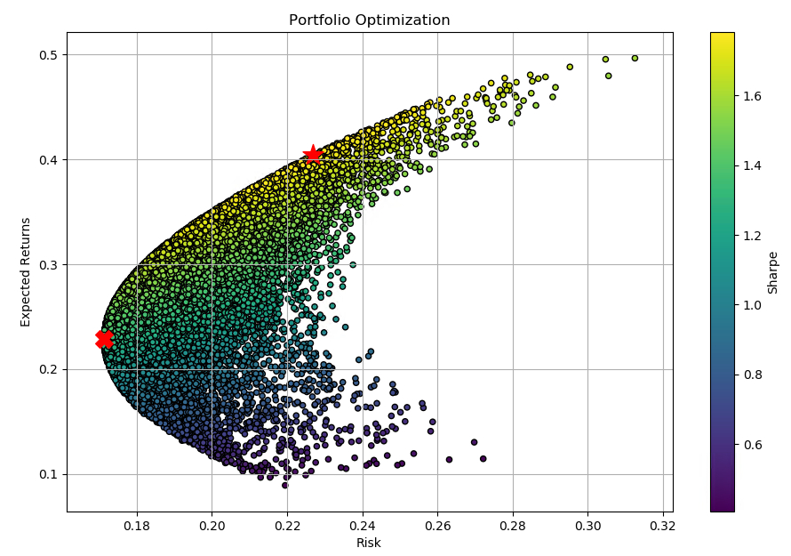

# 파이썬 증권 데이터 분석 (Stock Analysis in Python)
본 깃허브에서는 『파이썬 증권 데이터 분석』(한빛출판사, 2020) 서적과 관련된 소스 코드와 추가 자료를 공유합니다.

- 소스 코드는 각 장별 디렉터리에 존재하며, 이미지 파일들은 각 장별로 imgs 디렉터리에 존재합니다.

- 지면 관계 상 싣지 못한 파이썬 내장함수표와 AES-256 암복호화 실습은
10_Appendix_(Python_Built-in_Functions_and_AES-256_Encryption).pdf 파일을 참고하시기 바랍니다.

- 서적에 삽입된 그림의 PPT 원본은 PowerPoint_Materials.pptx 파일에 있습니다.

