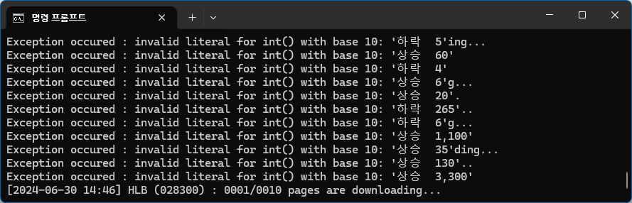
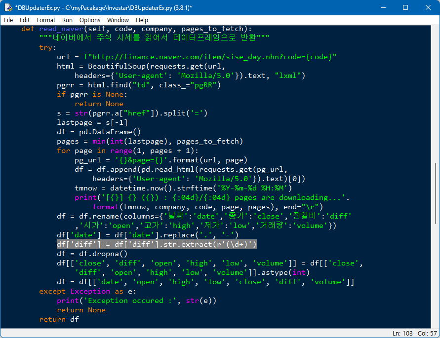
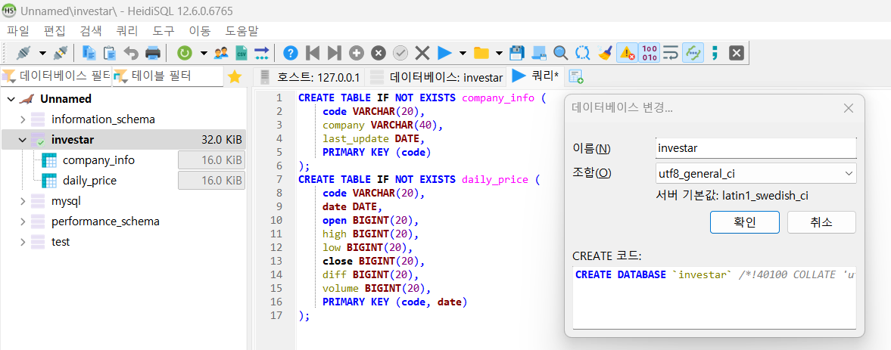
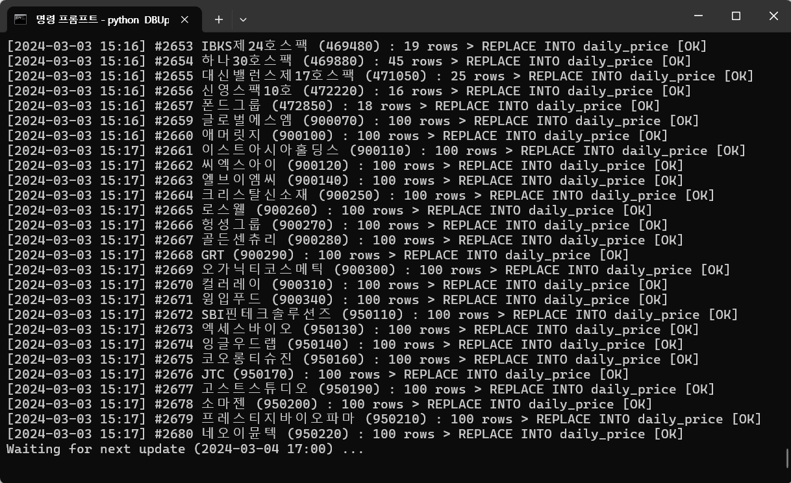
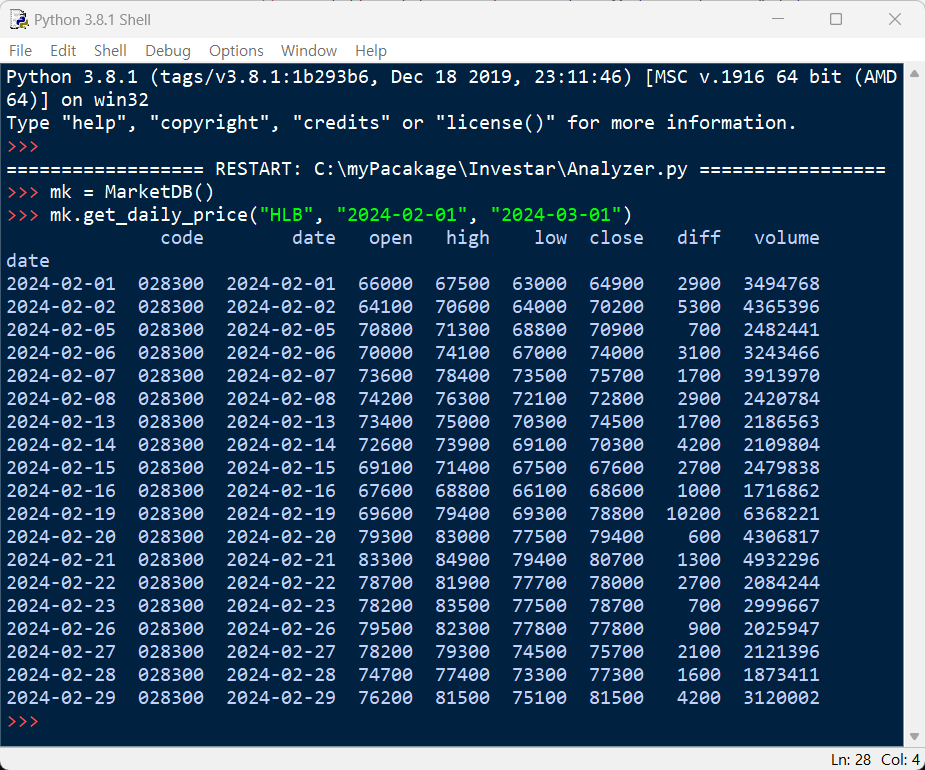

# 파이썬 증권 데이터 분석 (Stock Analysis in Python)
본 깃허브에서는 『파이썬 증권 데이터 분석』(한빛출판사, 2020) 서적과 관련된 소스 코드와 추가 자료를 공유합니다.

- 소스 코드는 각 장별 디렉터리에 존재하며, 이미지 파일들은 각 장별로 imgs 디렉터리에 존재합니다.

- 114 페이지 소스코드의 이미지 파일 URL은 http://bit.ly/2JnsHnT → http://bit.ly/3ZZyeXQ 변경됐습니다.

- 지면 관계 상 싣지 못한 파이썬 내장함수표와 AES-256 암복호화 실습은
10_Appendix_(Python_Built-in_Functions_and_AES-256_Encryption).pdf 파일을 참고하시기 바랍니다.

- 서적에 삽입된 그림의 PPT 원본은 PowerPoint_Materials.pptx 파일에 있습니다.

## 네이버 일별시세 전일비 데이터 변경에 따른 DBUpdaterEx 수정 내역
네이버 일별시세의 전일비 데이터가 기존에는 숫자로만 제공되었으나, 전일비 데이터에 상승/하락/보합 등의 문자열이 추가되면서 아래처럼 Exception이 발생하는 현상이 있었습니다. 

전일비 데이터(diff)에서 문자를 제외하고 숫자만 추출해서 처리하도록 DBUpdaterEx.py 코드를 아래와 같이 수정하였습니다. (2024-06-30 기준)

## 시세조회 DB 업데이트 및 시세조회 API 빠른 사용법
책이 출간된지 제법 시간이 흘렀고 파이썬 라이브러리에도 변경된 내용이 많아서 최신 라이브러리 간 호환성이 확보되지 않을 수 있습니다. 시세조회 DB를 빠르게 구축해서 시세조회 API를 사용하고자 하시는 분은 아래처럼 requirements.txt에 명시된 라이브러리 버전으로 설치하시 바랍니다. (2024-03-03 기준)  
1. Python 설치  
   ① Win+R키를 눌러서 실행창이 나오면 appwiz.cpl를 입력한 후 '프로그램 변경 및 제거' 창에서 기존에 설치된 Python을 전부 제거  
   ② https://www.python.org/ftp/python/3.8.1/python-3.8.1-amd64.exe 다운로드  
   ③ 설치 프로그램을 실행한 후 'Add Python 3.8 to PATH' 체크박스에 체크한 후 'Install Now'로 설치  
   ④ Python 설치가 완료되면 명령창을 새로 실행해서 python --version 명령으로 Python 3.8.1이 설치됐는지 확인
2. Python 라이브러리 설치  
   ① https://github.com/INVESTAR/StockAnalysisInPython/blob/master/02_Python_Programming/requirements.txt 다운로드    
   ② c:\Users\hwang\Downloads>python -m pip install --upgrade pip  
   ③ c:\Users\hwang\Downloads>pip install -r requirements.txt    
3. Investar 데이터베이스 생성   
   ① https://mariadb.com/downloads/ 접속  
   ② MariaDB Community -> Windows 64bit -> 10.5.24GA 다운로드해서 실행  
   ③ 바탕화면에 생성된 HediSQL 아이콘을 더블 클릭하여 실행한 후 Investar DB를 utf8_general_ci 로 생성
      
   ④ 쿼리 탭을 클릭해서 테이블 생성 쿼리를 실행  
     CREATE TABLE IF NOT EXISTS company_info ( 
    code VARCHAR(20),
    company VARCHAR(40), 
    last_update DATE, 
    PRIMARY KEY (code) 
);
CREATE TABLE IF NOT EXISTS daily_price ( 
    code VARCHAR(20),
    date DATE,
    open BIGINT(20),
    high BIGINT(20),
    low BIGINT(20),
    close BIGINT(20),
    diff BIGINT(20),
    volume BIGINT(20),
    PRIMARY KEY (code, date) 
);  
5. myPackage 생성 및 API 호출   
   ① c:\myPackage\Investar 폴더를 생성  
   ② https://github.com/INVESTAR/StockAnalysisInPython/tree/master/05_Stock_Price_API/Investar 폴더로부터 Analyzer.py, DBUpdaterEx.py, MarketDB.py를 다운로드 받아서 c:\myPackage\Investar 폴더로 복사   
   ③ c:\myPackage\Investar>python DBUpdaterEx.py 실행해서 데이터베이스를 업데이트
     
   ④ IDLE에서 c:\myPackage\Invesat\Analyzer.py 파일을 실행한 뒤 아래처럼 API 호출
      
   
## 네이버 금융의 웹 스크레이핑 차단에 대한 안내
아래 내용은 2021년 10월 11일에 발행된 5쇄 서적부터 반영되어 있으며,
기존에 발행된 1쇄~4쇄 서적을 구매하신 분들은 아래 내용을 참고하시기 바랍니다.

2021년 1월 7일 저녁부터 네이버 금융에서 웹 크롤러의 스크레이핑을 차단하기 시작했습니다. 
따라서 기존 방식대로 urllib.request.urlopen()이나 pandas.read_html()를 사용할 경우,
더 이상 네이버 금융의 웹 페이지를 읽어올 수 없습니다. 

네이버 금융 서버에서 http 패킷 헤더의 웹 브라우저 정보(User-Agent)를 체크하기 때문에,
웹 스크레이핑을 하려면 requests 라이브러리를 이용해 웹 브라우저 정보를 보내야 합니다.
변경된 코드는 아래와 같으며 DBUpdaterEx.py로 깃헙에 올려두었습니다.

http://httpbin.org/user-agent 사이트에 접속하시면 
현재 본인이 사용하는 웹 브라우저에 대한 정보를 확인할 수 있습니다.
샘플 코드의 "Mozilla/5.0"를 실제로 본인이 사용하는 웹 브라우저 정보로 변경하면
네이버 금융 페이지에서 차단될 가능성을 조금 더 줄일 수 있습니다.
