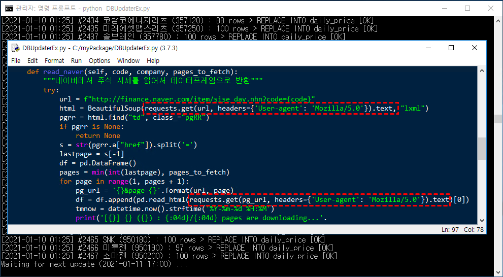

# 파이썬 증권 데이터 분석 (Stock Analysis in Python)
본 깃허브에서는 『파이썬 증권 데이터 분석』(한빛출판사, 2020) 서적과 관련된 소스 코드와 추가 자료를 공유합니다.

- 소스 코드는 각 장별 디렉터리에 존재하며, 이미지 파일들은 각 장별로 imgs 디렉터리에 존재합니다.

- 지면 관계 상 싣지 못한 파이썬 내장함수표와 AES-256 암복호화 실습은
10_Appendix_(Python_Built-in_Functions_and_AES-256_Encryption).pdf 파일을 참고하시기 바랍니다.

- 서적에 삽입된 그림의 PPT 원본은 PowerPoint_Materials.pptx 파일에 있습니다.

## 네이버 금융의 웹 스크레이핑 차단에 대한 안내
2021년 1월 7일 저녁부터 네이버 금융에서 웹 크롤러의 스크레이핑을 차단하기 시작했습니다. 
따라서 기존 방식대로 urllib.request.urlopen()이나 pandas.read_html()를 사용할 경우,
더 이상 네이버 금융의 웹 페이지를 읽어올 수 없습니다. 

네이버 금융 서버에서 http 패킷 헤더의 웹 브라우저 정보(User-Agent)를 체크하기 때문에,
웹 스크레이핑을 하려면 requests 라이브러리를 이용해 웹 브라우저 정보를 보내야 합니다.
변경된 코드는 아래와 같으며 DBUpdaterEx.py로 깃헙에 올려두었습니다.

http://httpbin.org/user-agent 사이트에 접속하시면 
현재 본인이 사용하는 웹 브라우저에 대한 정보를 확인할 수 있습니다.
샘플 코드의 "Mozilla/5.0"를 실제로 본인이 사용하는 웹 브라우저 정보로 변경하면
네이버 금융 페이지에서 차단될 가능성을 조금 더 줄일 수 있습니다.
